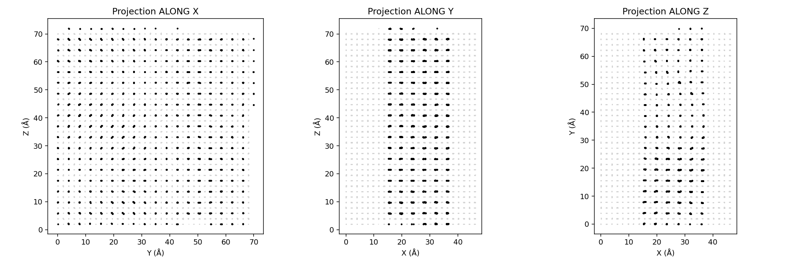

# Phase 0 diagnostics report

**Verdict: BLOCKED** (1 FAIL, 0 WARN)

Generated by `diagnostics.py`. Plots in `diagnostics_plots/`.

## 0a — Geometry & beam direction

| Check | Value | Verdict | Note |
|---|---|---|---|
| POSCAR atoms | 19440 | **INFO** | O=11664, Pb=1944, Sr=1944, Ti=3888 |
| Pre-rotate cell | 70.008 × 70.008 × 47.884 Å | **INFO** |  |
| Post-pipeline cell | 47.884 × 70.008 × 73.935 Å | **INFO** | angles 90.0,90.0,90.0 |
| Atom count after orthogonalize | 19139 | **INFO** |  |
| Candidate thickness if beam==X | 47.884 Å | **INFO** |  |
| Candidate thickness if beam==Y | 70.008 Å | **INFO** |  |
| Candidate thickness if beam==Z | 73.935 Å | **INFO** |  |
| Existing recon real_space_thickness | 70.008 Å | **PASS** | closest to axis Y (70.008 Å, Δ=0.000) |
| Beam-axis convention | existing recon used axis Y, abTEM beam=Z | **FAIL** | Set REAL_SPACE_THICKNESS = atoms.cell.lengths()[2] in params.py |

Inspect: the projection along the vortex axis shows Pb columns as tight dots; perpendicular projections show the swirl. Currently abTEM beam = +Z (third panel).

## 0b — Parameter sanity sums

| Check | Value | Verdict | Note |
|---|---|---|---|
| WAVELENGTH (300 keV) | 0.0197 Å | **PASS** | h / sqrt(2 m E (1 + E/(2 m c²))) |
| Depth resolution dz = λ/α² | 1.97 Å | **PASS** | PTO unit cell ≈ 3.9 Å, sub-UC achievable iff dz < 3.9 Å |
| PROBE_FWHM_FOCUSED (Airy) | 0.120 Å | **PASS** | 0.61 · λ / α |
| GEOMETRIC_SPREAD at overfocus | 1.000 Å | **INFO** | α · Δf with Δf = 10 Å overfocus |
| PROBE_FWHM_EFFECTIVE | 1.007 Å | **INFO** | quadrature sum of focused FWHM and geometric spread |
| SCAN_STEP | 0.252 Å | **PASS** | (1 − 0.75) · FWHM_eff → 75% overlap |
| Recommended sim SLICE_THICKNESS | 0.500 Å | **INFO** | Existing 0.31 Å is over-fine; 0.8–1.0 Å is sufficient for 100 mrad. |
| VRAM cap (user) | 8 GB | **INFO** | Drives detector-size and batch caps (see 0e). |

## 0c — Phonon σ literature cross-check (300 K, isotropic)

| Check | Value | Verdict | Note |
|---|---|---|---|
| σ(Pb) | 0.092 Å | **PASS** | literature range 0.080–0.110 Å |
| σ(Sr) | 0.085 Å | **PASS** | literature range 0.075–0.100 Å |
| σ(Ti) | 0.072 Å | **PASS** | literature range 0.060–0.085 Å |
| σ(O) | 0.085 Å | **PASS** | literature range 0.075–0.100 Å |

Reminder: sigmas are placeholders. Confirm against the user's preferred Debye-Waller table or DFPT phonon DOS before the production run.

## 0d — Existing-data inspection

| Check | Value | Verdict | Note |
|---|---|---|---|
| Sample tile tile11_bf.zarr | shape (16, 16, 45, 65), dtype float32 | **INFO** |  |
| Average BF disk radius (pixels) | 10 | **PASS** | ≥8 px diameter required for ePIE updates |
| Existing recon npz keys | object_complex, object_phase, probe, num_slices, slice_thickness, real_space_thickness, scan_step_input, reconstruction_pixel_size… | **INFO** |  |
| object_phase shape | (98, 264, 356) | **INFO** |  |
| XY-std ratio across Z slices | 21.75 | **PASS** | want >2× contrast between sample and vacuum |
| FFT_z power away from kz=0 | 0.72× of DC | **PASS** | FAIL means reconstruction has no axial structure |

## 0e — Detector design study

| Check | Value | Verdict | Note |
|---|---|---|---|
| Box dims used (X,Y,Z) | 47.88 × 70.01 × 73.93 Å | **INFO** |  |
| Native pixel mrad (X / Y) | 0.411 / 0.281 | **INFO** | abTEM detector pixel size before binning |
| Recommended config | θ_max=200 mrad, N=64, K=15 | **PASS** |  |

Sweep over detector outer angle and target detector size:

Note: CBED is asymmetric (X coarser). N_act = coarse-axis pixels; fine axis is larger.
py4DSTEM resamples to square during preprocess; disk/DF quoted on worst (coarse) axis.

| θ_max | N_tgt | K | N_coarse | mrad/px | BF_disk_px | DF_r_px | KB/pos | GB(9 tiles) | R1 | R2 | R3 | R4 | pick |
|---|---|---|---|---|---|---|---|---|---|---|---|---|---|
| 150 | 48 | 15 | 48 | 6.17 | 32 | 8 | 13.3 | 0.031 | ✓ | ✗ | ✓ | ✓ |  |
| 150 | 64 | 11 | 66 | 4.52 | 44 | 11 | 25.0 | 0.059 | ✓ | ✗ | ✓ | ✓ |  |
| 150 | 96 | 7 | 104 | 2.88 | 69 | 17 | 61.8 | 0.146 | ✓ | ✓ | ✓ | ✓ |  |
| 150 | 128 | 5 | 146 | 2.06 | 97 | 24 | 121.5 | 0.287 | ✓ | ✓ | ✓ | ✓ |  |
| 200 | 48 | 20 | 48 | 8.22 | 24 | 12 | 13.3 | 0.031 | ✗ | ✓ | ✓ | ✓ |  |
| 200 | 64 | 15 | 64 | 6.17 | 32 | 16 | 23.5 | 0.055 | ✓ | ✓ | ✓ | ✓ | **←** |
| 200 | 96 | 10 | 97 | 4.11 | 49 | 24 | 53.8 | 0.127 | ✓ | ✓ | ✓ | ✓ |  |
| 200 | 128 | 7 | 139 | 2.88 | 69 | 35 | 110.2 | 0.260 | ✓ | ✓ | ✓ | ✓ |  |
| 250 | 48 | 25 | 48 | 10.28 | 19 | 15 | 13.3 | 0.031 | ✗ | ✓ | ✓ | ✓ |  |
| 250 | 64 | 19 | 64 | 7.81 | 26 | 19 | 23.2 | 0.055 | ✗ | ✓ | ✓ | ✓ |  |
| 250 | 96 | 12 | 101 | 4.93 | 41 | 30 | 58.4 | 0.138 | ✓ | ✓ | ✓ | ✓ |  |
| 250 | 128 | 9 | 135 | 3.70 | 54 | 41 | 103.9 | 0.245 | ✓ | ✓ | ✓ | ✓ |  |

Selection rules in priority order:
  R1: BF disk diameter ≥ 28 px (ePIE updates need ~12 px radius + margin)
  R2: dark-field radius ≥ 12 px (axial sectioning needs DF info)
  R3: total stored 4D-STEM ≤ 1 GB (compressed will be ~5–10× smaller)
  R4: cropped-FFT working set (≈ N²·batch·8 B·num_slices) ≤ 2 GB on 8 GB GPU

**Recommended detector**: θ_max = 200 mrad, N = 64, bin K = 15, pix_mrad = 6.17, BF disk = 32 px diameter, DF radius = 16 px, ~55.4 MB across all 9 tiles.

## 0f — Storage & wall-clock projection

| Check | Value | Verdict | Note |
|---|---|---|---|
| Recommended sim config | 4 phonons, 1 Å slice | **PASS** | per-tile 9.9–12.4 h |
| Toy budget | ≤ 1 h target | **INFO** | 1 tile × 4×4 scan × n_configs=2 × slice=2.0 Å for the gating end-to-end run |

Per-tile wall-clock projection (relative to existing 8–10 h baseline):

| n_configs | sim slice | scale | per-tile h | 9-tile h | verdict |
|---|---|---|---|---|---|
| 4 | 1.0 Å | ×1.24 | 9.9–12.4 | 89–112 | PASS |
| 4 | 1.5 Å | ×0.83 | 6.6–8.3 | 60–74 | PASS |
| 8 | 1.0 Å | ×2.48 | 19.8–24.8 | 179–223 | WARN |
| 8 | 1.5 Å | ×1.65 | 13.2–16.5 | 119–149 | PASS |
| 1 | 1.0 Å | ×0.31 | 2.5–3.1 | 22–28 | PASS |

**Recommended: 4 phonons, 1 Å slice** (per-tile 9.9–12.4 h, 9-tile 89–112 h)

Toy (1 tile, 4×4 scan positions, n_configs=2, slice=2 Å) target: ≤ 1 h
